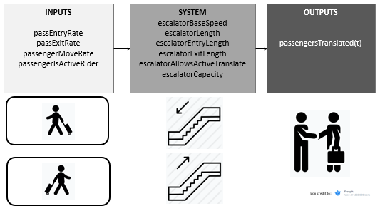
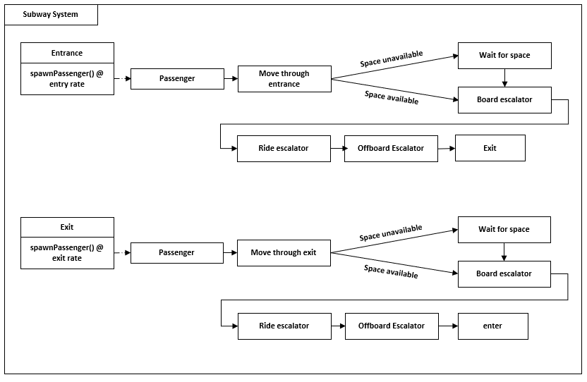

# Assignment 1 - Designing Models and Analyzing Data (Template)

> * Participant name: Rhyse Bendell

> * Project Title: The Subway Congestion Problem: High Flow and Movement Speeds

# General Introduction

The first part of this assignment explores designing models (and basic Python/Git features). 

We will look at **subway model in a city** system. A **subway system** is an underground, tube, or metro, underground railway system used to transport large numbers of passengers within urban and suburban areas - modern subways use different types of electronic data collection sensors to supply information which is used to manage assets and resources efficiently. 

The second part of the assignment explores data analysis. Data analysis and visualization is key to both the input and output of simulations. This assignment explores different random number generators, distributions, visualizations, and statistics. Additionally, it will look at getting you accustomed to specifying input and output variables to a system. We will also practice working with real data.

# Part 1: Designing a Model - Subway System

Mass transit is already a vital component for cities hosting large populations, and as populations continue to increase the importance of optimizing the capability of transit systems will similarly increase. Although the potential for remote work opportunities may somewhat mitigate the demand for mass transit options, the reality of climate change and the cost of personal transportation (vehicles, road maintanence, fuel transport, repair, etc.) will necessitate expansion of mass transit systems: the more we can understand about their design and use now may help to reduce negative reactions to the transition to reliance on mass transit such as subways and trains.

Some nations have already begun to feel the strain of populations that have grown beyond the capabilities of mass transit. Many videos captured in Japan and portions of China show passengers literally packed into underground transport cars by the force of several individuals, and while those snapshots may be amusing from the outside that discomfort is not a far off reality for cities such as New York or Washington D.C.

The problem of human transportation is, of course, not a new one, and with the rapid technological advancements witnessed in the last century we may be equipped to handle developing challenges. While engineers work to achieve game-changing tech such as bullet trains and their ilk, it is up to researchers on the human-factors and modeling side of the equation to explore how best to leverage any new and existing systems. Fortunately, we exist in an age of data abundance: models and simulations which previously may have been based on speculation, or a single researcher's afternoon at the stairs of the Tube may now be replaced by empirical data regarding passaenger loads, behaviors, preferences, and more which can inform models which may be used to improve both the structural and social engineering associated with our transit technologies.

## (Part 1.1): Requirements (Experimental Design) **(10%)**

IDS6145: Requirements Definition

**What is the User’s Need? **

At the highest level, the need of individuals utilizing the subway system is to get from point A to point B. Although it may not be the highest priority of all users, it seems reasonable to assume that minimizing the time in transit is a shared goal of the majority. 

Arguably, additional requirements could be considered such as comfort (e.g., the situation during rush hour during Japan may have developed to be culturally acceptable, but would probably discomfort most Westerners), lack of effort, and cost. Specifically, with regards to the escalators that lead to and from the subway cars a users needs may be generalized as: rate of access to transit, social comfort/human proximity, and reduction of effort (i.e. not having to walk). 

**What is the Simuland? **

Considering the Subway escalator problem, the system that needs to be simulated is not just the action of the escalators themselves, but also the flux of individuals passing through (rather, up and down) the escalators. The particular components that may be most relevant to such a simulation include the rate of passenger entrance from both ends of an escalator section (assuming that space in the subtending spaces has a limited capacity), the length of the escalators (could be operationalized as the rate at which passengers are passively transported from Onboard-->Offload), the number of people that can be packed onto any given escalator, the number of escalators available for exit or entry,and the ability of passengers to engage in active translation.

Including such variables in the simulated model allows for a several easily accesible "experiments." The entry and exit rates provide easy access to analysis of factors such as lull and rush periods as well as potential comparability between structural subway system designs that intentionally limit or promote passenger flow at either end. The characteristics of the modeled escalators themselves may additionally be modified: the number of passengers that can be accomodated by any given escalator, number of escalators, and passive translation rates for instance may provide insight into activiation patterns that may be appropriate for given entry/exit rates.

**What needs to be learned about it? **

Naturally, this portion of any modeling approach is purely arbitrary: the only things that need to be learned about anything are what one wants to learn. The context of optimizing passenger transit in an overly populated society may drive a few desired learning objectives such as determining the maximum number of passengers that may be translated by a given existing system, the ideal escalator activation patterns (i.e., number dedicated to entry versus exit) to support optimum flow at a given set of passenger exit and entry rates, the optimum physical design of escalators to maximize passengers while maintaining safety (it could be that wider escalators with shallower steps could benefit max passenger levels, though there are mechanical considerations that may pose problems), or even the ideal behaviors of passengers that most benefits overall translation (e.g., the "please just stand" request discussed in IDS6145).

**What are the measures of effectiveness to be produced? **

Taking the examples given above, the relevant metrics follow from the questions themselves: maximum number of passengers may be quantified as precisely that, a count of passengers, whereas something more abstract such as ideal behavior may yield a measure of effectiveness that is dependent on several metrics such as passenger count per relevant epoch, overall passenger comfort, and average passenger satisfaction (it may be that the majority of passengers prefer to engage in active translation, and that a purely passive translation system may optimize passenger count but reduce overall satisfaction).

Here I'll focus on the problem of congestion during an arbitrary rush hour, and focus on a desired outcome of "maximum passengers translated" as a result of the walking speed of active escalator passengers. I will assume that the culture of "stand on the right, walk on the left" is still accepted for the model such that half of the available escalator capacity is composed of passive passengers and (roughly) half composed of active passengers walking on the escalators at a range of speeds. As a pseudo-control I will compare the passenger count outcomes of two active walking speeds (relative to escalator base speed: 0.5*base, 2*base) to that of transitioning to a "passive rider only" system at two separate entrance and exit flow rates (i.e., active passenger speed of 0). Given those predictors I would expect the overall higher entrance and exit rates will lead to greater passengers transported, and that there will be an interaction between flux rates and active rider behavior such that during periods of high flux the least passengers would be translated by active passengers moving slowly whereas no motion and high movement speed will yield similar outcome counts. 

## (Part 1.2) Subway Congestion Model **(10%)**

* [**Object Diagram**](model/object_diagram.md) - provides the high level overview of objects that will be needed for a detailed simulation of the subway congestion problem. 

* [**Class Diagram**](model/class_diagram.md) - provides details of the components of the objects needed for the subway simulation. 

* [**Behavior Diagram**](model/behavior_diagram.md) - provides details of the high level sequence of the problem space and, in this case, the movement of passengers through the space. 

Although not necessary for the simulation itself, I find it helpful to reference a layout of the physical space in which objects are being simulated. The subway problem consists of agents being generated at either end of the escalator area (either entering or exiting) and proceeding through the space to the opposite end. For the sake of this simulation, I'll be treating Enter-->Exit as the positive direction of flow.

Generally, passengers will be spawned at either end of the space (and imbued with properties such as "active passenger" and "entering passenger") and then increment through the space at predetermined rates (a base walk speed for all passengers) before arriving at the escalators. If an escalator along their direction of flow can accept a passenger, they will board the escalator and move at either the escalator's speed or that speed + and active walk speed (if they are an active passenger). After disembarking on the other side passengers will continue to move at their base walk speed. For simplicity's sake, passengers will always be able to disembark, but will only be spawned if the occupancy at their spawn location does not exceed capacity. 

The simulation in this case is a psuedo-continuous as each passenger will be treated as an agent that may change its state at each time increment (dt). Accordingly, each of the functions detailed in the next section may be executed at each time increment. 

* [**Agent / User case** (if appropriate)](model/agent_usecase_diagram.md) - User cases are not relevant to the simulation descibed here considering that the only user input is to change the IVs as appropriate to generate the simulated data. 

## (Part 1.3) Subway Congestion Problem Simulation **(10%)**

To actually run the Congestion Problem simulation I would setup a continuous simulation capable of creating passengers in the described subway space and imbuing them with the movement and action behaviors appropriate for each of the IVs. The passengers themselves would determine most of the behavior in the simulation as their motion through the spaces would lead directly to the final passenger count DV; however, the capacity of the spaces for a certain number of passengers would also play a role in causing congestion. 

The general structure I would use would rely on a loop to increment through time (up to a certain amount of time, say 2 hours) after the initial variables of interest had been set: namely, the rate at which passengers should be spawned (to represent the amount of "rush" during a given rush hour), the probability that a given passenger may be an active passenger (i.e., the number of people that actually would choose to walk instead of ride on the escalator), the rate at which active passengers move, the capacity of each of the spaces for passengers, the size of each of the spaces, the number of entrance/exit escalators, and the capacity ratio of each escalator for active versus passive passengers. 

By incrementing through time and keeping track of the number of passengers that succesfully pass through the simulated terminal, the simulation would produce the "passenger count" DV as a function of the specific IVs (active passenger movement rate, and rate of passengers attempting to enter/exit). Running the simulation multiple times for each IV set (or simply building an extra loop into the code to have it run several times for each IV) would produce a set of passenger counts for each IV, and as count data lends itself to analysis by ANOVA the simulation would facilitate the final experimental analysis by generating the entire data set. 

## (Part 1.4) Subway City Congestion Model **(10%)**

You are expected to create the python files - the code should run without errors, create and object(s) for your system, but not provide function detail.

## (Part 1.5) Specifying the Inputs to a System **(10%)**

* Specify the independent and dependent input variables of your subway esclator model

	The 2 IVs - Congestion, and Active Passenger Move Rate - respectively have 2 (Congestion: Low, High) & 3(Rate: Null, Low, High) levels. There is a single DV - passenger count - which is determined by the total number of passengers that pass through the subway terminal during the alloted time. 

* Specify where the data will come from measured subset of real data (empirical) or synthetic data

	The IVs will be determined from real world data that indicate reasonable values for "Low" versus "High" rates of passenger passage during rush hours as well as the rates at which active passengers may be expected to walk up or down escalators. The DV of passenger count will be produced only by the simulation unless real world data can be found that provides exact numbers for the IVs as well as associated DV outcomes for each level.

* What kind of statistics are important to capture this input data

	The necessary data for determining the IVs will be best informed by statistics regarding the count of passengers that pass into and out of a representative escalator section during low demand and high demand periods (the count can then be transformed into a rate by determining the period of time during which the count was gathered), and an estimate of the rate at which active passengers walk on the subway (will likely be just short of average walking speed - I'm sure statistics exist regarding average stair climbing/descending rates).

* How do you plan to analyze the output of your model?

	The passenger count data produced for each level of the experimental design (6 cells total) will be compiled into a .csv file such that each row contains IV labels (e.g., LowCongest HighActiveRate) as well as an outcome count produced by the simulation when run at that IV set. That setup will allow me to import the data into JASP and run a one-way ANOVA to determine whether either of the manipulated variables had an effect on the outcome counts as well as whether there is a significant interaction between the variables (significance determined in this case by a null-hypothesis test associated with p values less then .05).

* What ways will you visualize your data - charts, and graphs you will create?

    The outcomes of this experiment will be best visualized as a combined bar chart including the mean count for each condition as well as an indication of standard error around those means. 

* What clever way will you visualize your output with a useful infographic?

	The primary question I will be answering is whether passengers should walk up escalators (while others leave room to do so) or stand depending on current congestion conditions. Perhaps a graphic indicating that if "this many people are within arms reach" don't try to walk up the escalator would be an appropriate intuitive rule of thumb that could also contain some useful reference numbers for the effect of trying to be an active passenger when conditions aren't appropriate. 

# Part 2: Creating a Model from Code

## (Part 2.1) **P**ortable **O**rganic **T**rouble-free **S**elf-watering System (**POTS**) Model **(10%)**

Here [**we provide an overview**](code/POTS_system/README.md) of the **P**ortable **O**rganic **T**rouble-free **S**elf-watering System (**POTS**) Model and provide a source code template for the code found in  [**the following folder**](code/POTS_system/). Please create a **class** diagram of this model (replace the placeholder diagram). (you can use paper and pencil or a digital tool).

# Part 3: Data Analysis

## (Part 3.1) - Real Data **(10%)**

Find a datasource that looks at part of this model - subway stations locations / escalator number, heights, widths / volume of passangers - ridership numbers   (*fits* - we are pretty loose here, it can be anything.)

* Write up a paragraph that describes the data and how it fits into your system.

* Load the data into Python

* Calculate a few useful statistic on the data - keep it simple- STD, means, etc..., this is just designed * to get used to working with real data. Explain the insights you derive from these statistics.

* Visualize the raw data - visualize a few critical aspects of the data to better describe what it is, what it is showing, and why its useful to your system.

* Calculate and plot some summary statistics that better describe the data.

(Add your plots and visualization here)

(Put your data into the data directory)

## (Part 3.2) -  Plotting 2D Random Number Generators **(15%)**

This portion of the assignment looks at generating random numbers in Python and understanding how to properly plot them. Plot two different random numbers, pseudo random and quasi random, for five different N values. There should be 10 subplots, all properly formatted 2D plots. Note, each of the N points will have two coordinates, an x and a y, therefore you will need to generate two random numbers for each point. You should replace the image with your results in a simalar format. Discuss how the patterns differ. Feel free to change the N values from the suggested N values in the image to state your case.

## (Part 3.3) -  Plotting 1D Random Distributions **(15%)**

Now, choose three different distributions to plot in 1D, or as a histogram. Choose a pseudo-random generator and generate three different distributions. Example distributions are Uniform (part 8), Normal, Exponential, Poisson, and Chi-Squared, but feel free to use any three distributions of your choice. Again, plot each distribution for five different Ns. This will result in 15 different subplots, formatted similar to the image in Part 8. Include your properly formmated 1D plots below and breifly describe what we are looking at and how things change as N is changed.

Repeat the above using a quasi-random generator. Discuss the similarities and differences.

